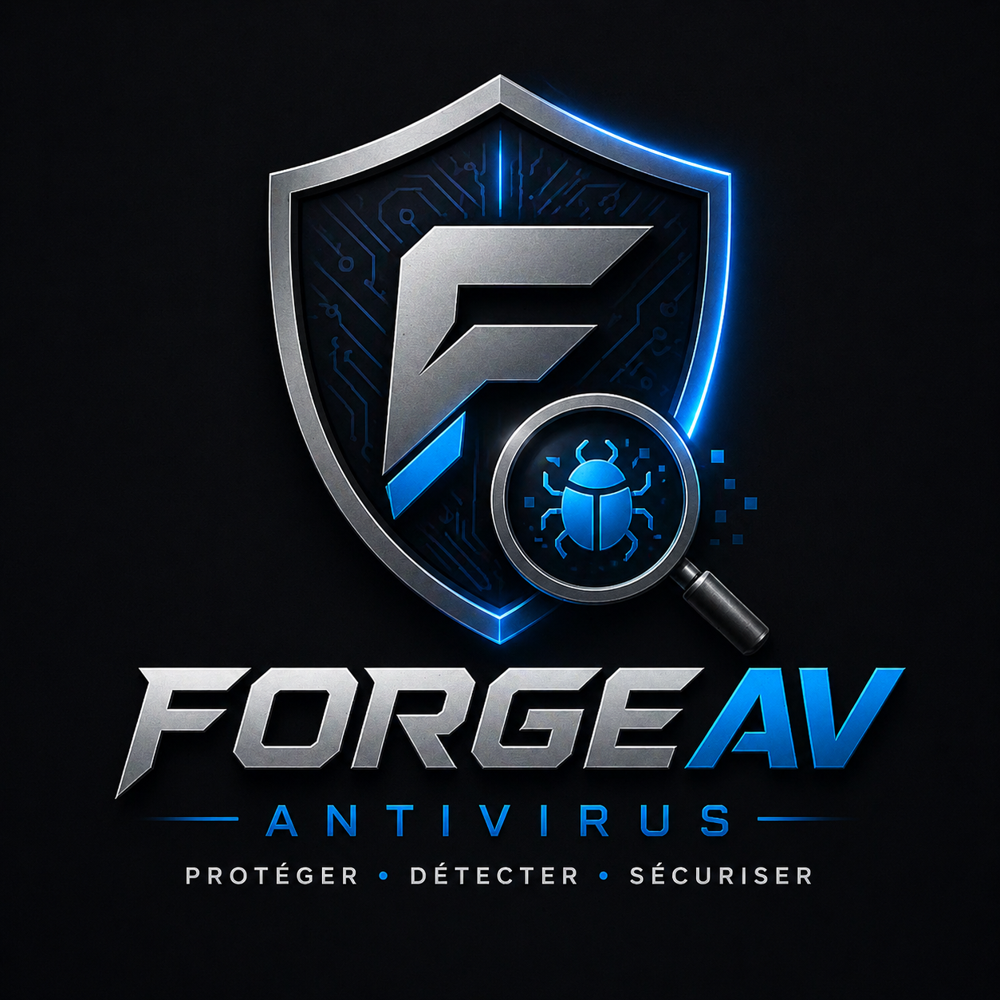
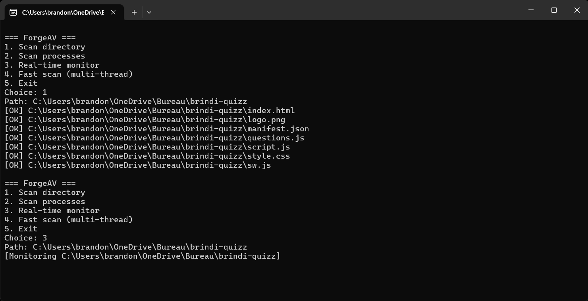

# ForgeAV

Antivirus pour Windows.

## À propos
ForgeAV propose un scanner de fichiers, un scan de processus, une surveillance en temps réel et un mode multithread pour des analyses rapides.

## Fonctionnalités
- Scan de dossier
- Scan des processus en cours
- Surveillance en temps réel
- Scan rapide multithread
- Quarantaine des fichiers suspects
- Logs de scan

## Installation
### Prérequis
- `gcc` (MinGW ou autre compilateur compatible)
- Windows
- Exécution recommandée en administrateur

### Compilation
- Utilisez `build.bat` dans le dossier racine
- Ou exécutez manuellement :
  `gcc main.c core/*.c security/*.c -o forgeav.exe -lcrypt32`

## Utilisation
Lancez `forgeav.exe`.

Menu disponible :
1. Scanner un dossier
2. Scanner les processus
3. Surveillance temps réel
4. Scan rapide multi-thread

> Démarrez en mode administrateur pour autoriser l’accès aux dossiers sensibles.

## Structure du projet
- `main.c` - point d’entrée
- `core/` - logique principale du scanner
- `security/` - gestion des logs et quarantaine
- `database/` - signatures et listes de hachages
- `assets/` - logo et captures d’écran

## Démonstration d'utilisation 
- scan d'un dossier complet
  

## Tests
- Créez un fichier contenant le mot `trojan` pour tester la détection.

## Quarantaine et logs
- `logs/` - fichiers de journalisation des scans
- `quarantine/` - fichiers isolés

 ## MIT Licence 
 
 ce projet est sous licence MIT.
 
 ## Contributeur 

  

<table align="center">
  <tr>
    <th>Nom</th>
    <th>GitHub</th>
    <th>Rôle</th>
  </tr>
  <tr>
    <td>Brandon Moukam</td>
    <td><a href="https://github.com/jujucram">jujucram</a></td>
    <td>Fondateur • Développeur principal • Antivirus Engine Developer</td>
  </tr>
</table>

## Open Source & Communauté

ForgeAV est un projet open source ouvert à tous.

Vous pouvez contribuer en :

- signalant des bugs
- proposant des améliorations
- ajoutant de nouvelles fonctionnalités
- améliorant les performances du moteur

---

Comment contribuer

1. Fork le projet
2. Crée une branche ("feature/ma-fonctionnalite")
3. Commit tes modifications
4. Push sur ton fork
5. Ouvre une Pull Request

---

Rejoindre le projet

  
  
  

  Construit avec passion pour la communauté open source

